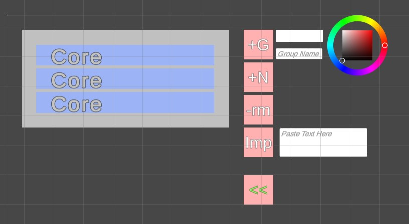

# Enhanced-Prompt-Input-Overlay
Visualization for creating prompt for text-to-image.

## This is a work in progress.

## Only work in Windows.

## No, since I don't have a MAC.

## Fk, I'll never do Unity UI thing in World Space again

#### TODO : 
A proper UI design !!!

This is what it looks like now

#### Features : 
- [x] Overlay
- [x] Basic UI layout
- [x] Text editing and node creating/removing/dragging
- [x] Group creating/removing
- [x]   naming/coloring
- [x]   dragging/dragging without leaving the parent (to prevent order being messed up when dragging)
~~- [ ] Previewing the target location of dragged object~~
~~- [ ] Multiple node/group selection/dragging~~
- [X] Convert to UI workspace, using Unity UI Extentions
- [X] Export node to text (copy and collapse should be the same button)
- [X] Import text to node
- [ ] Proper UI layout (R's work)
- [ ] Customizable Panel location
- [ ] Shortcut keys (for faster editing)
- [ ] Animation
- [ ] Customizable UI layout (?)

Devlog :
- 2023-01-01: Happy New Year! and almost all mechanic is done. Now just need to make it look good.
- 2022-12-31: Full re-work done. Now using Unity UI Extentions. Also, no multiple selection/dragging, since it's not really needed.
- 2022-12-19: Outline effect when dragging
- 2022-12-16: Group/Node dragging and dragging without leaving parent
- 2022-12-12: Group Creation and some code clean up
- 2022-12-11: Move text edit to Canvas space, and finished text editing feature. Also Add node feature.
- 2022-12-11: Basic text edit feature with complex parent-child auto expansion. Why did I choose to do this outside Unity canvas...
- 2022-12-10: Basic object resize and move.
- 2022-12-08: Basic overlay (transparent application window).